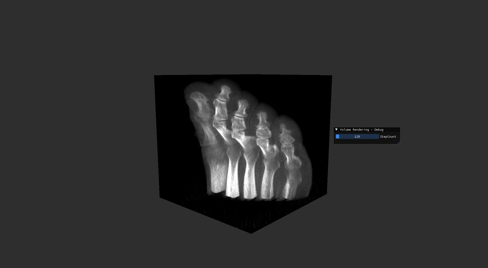

# GLVolumeViewer

An OpenGL Volume Viewer for `.raw` files.  
Inspired by: https://github.com/SuboptimalEng/volume-rendering/tree/main

---

## Overview

This is a volume renderer built using:

- OpenGL
- SDL
- GLM
- ImGui

The renderer performs ray marching by intersecting a ray with the volume bounding box and sampling from a 3D texture.

```cpp
glTexImage3D(
    GL_TEXTURE_3D,
    0,
    GL_R8,
    WIDTH,
    HEIGHT,
    DEPTH,
    0,
    GL_RED,
    GL_UNSIGNED_BYTE,
    volumeData.data()
);


